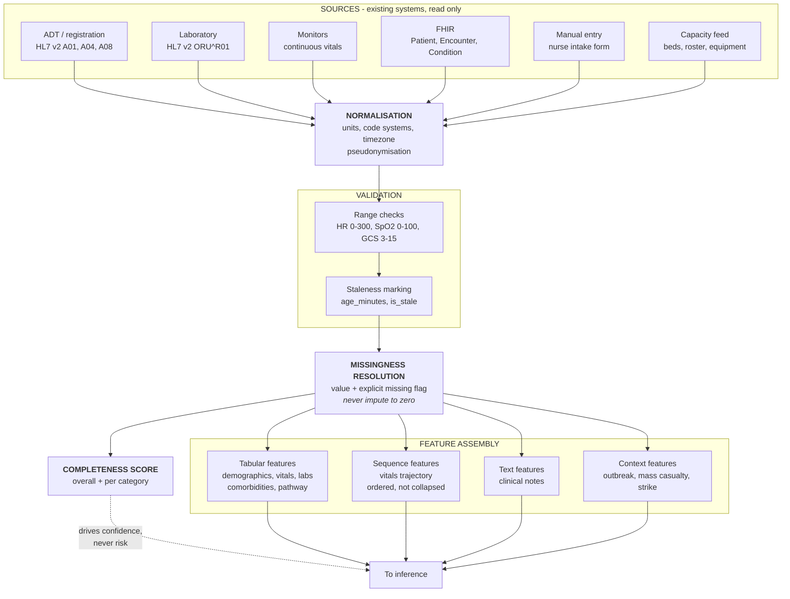
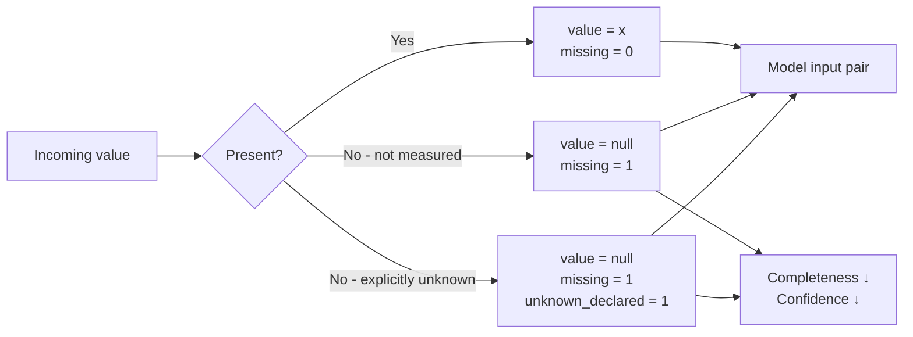
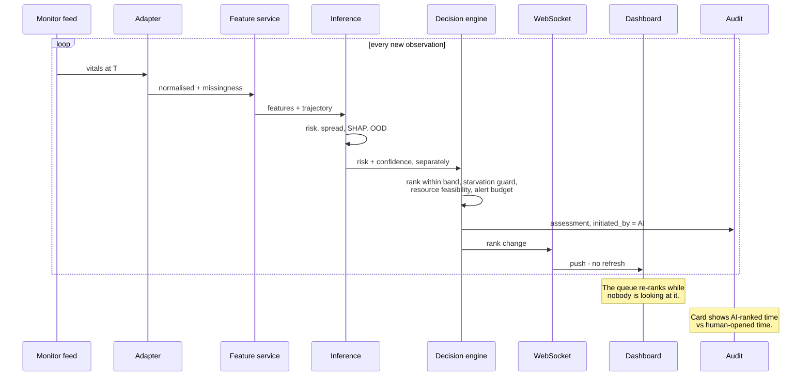
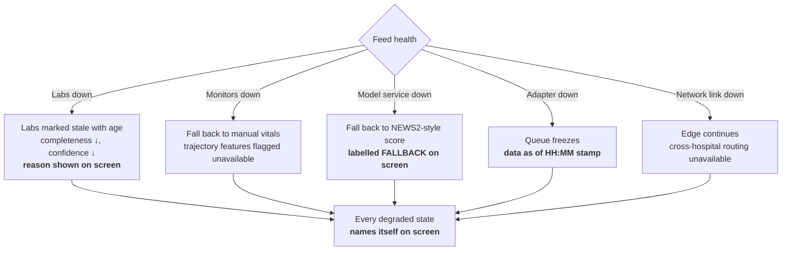
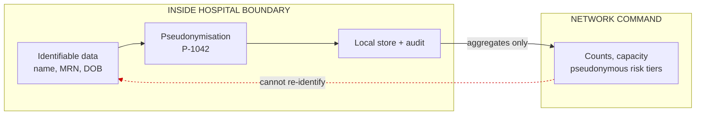

# Data Flow — Ingestion to Features

## 1. End-to-end ingestion

**Two rules are enforced structurally here, not by convention:**

1. **Missingness resolution is a mandatory stage** every value passes through. There is no path
   from a source to a feature that skips it, so imputation-to-zero cannot happen by accident.
2. **Completeness drives confidence, never risk.** The dotted edge is deliberate. A patient is not
   sicker because we know less about them — we are merely less sure. Wiring completeness into the
   risk path is the single most common way teams fail the T+8 challenge.

---

## 2. Missingness handling

The model always receives a **pair** — value and missingness flag — so it can learn what absence
itself predicts. A missing platelet count on a dengue patient at day 4 is informative: it usually
means the test has not come back yet, which is itself a fact about how recently the patient arrived.

`unknown_declared` separates *"nobody asked"* from *"we asked and the patient does not know."*
The case is explicit that Unknown must not be treated as No; this is where that is enforced.

---

## 3. Continuous re-assessment loop — where the theme lives

**This loop is "AI makes the first move" as a system property**, not a UI flourish. The
architecture is a continuous evaluator that pushes, not a scorer that answers when asked.

The `AI-ranked time` vs `human-opened time` gap on each card is the visible proof. Show a card
where the AI acted at 20:11:03 and the nurse opened it at 20:14:12 — three minutes in which the
system had already acted.

---

## 4. Degradation paths

**Degrade visibly.** A system silently showing stale data as current is more dangerous than one
plainly offline, because it looks trustworthy while being wrong.

This is also the theme applied to the system's own failures: **the AI announces its degradation
before a clinician discovers it.** Worth saying aloud — it shows the theme is a design principle
rather than a feature list.

---

## 5. Privacy boundary

Re-identification is possible **only inside the originating hospital**. The network layer is
structurally incapable of it, which is a stronger privacy answer than any policy, because it does
not depend on anyone behaving correctly.