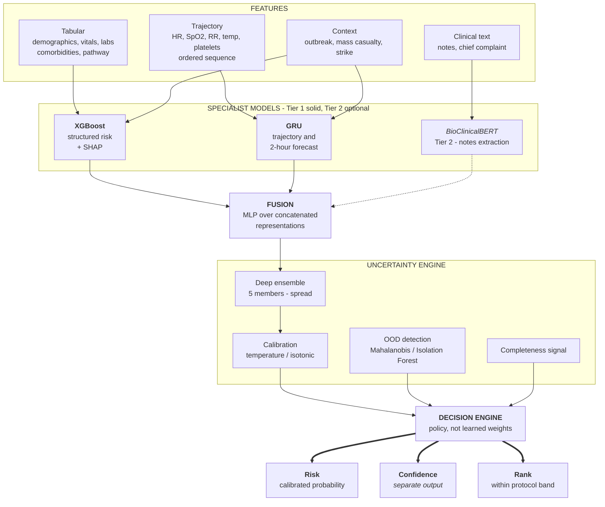
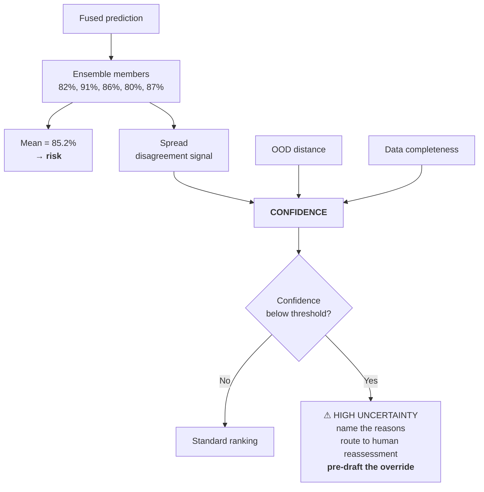
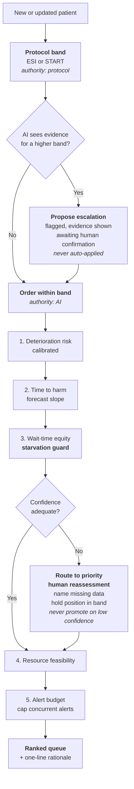
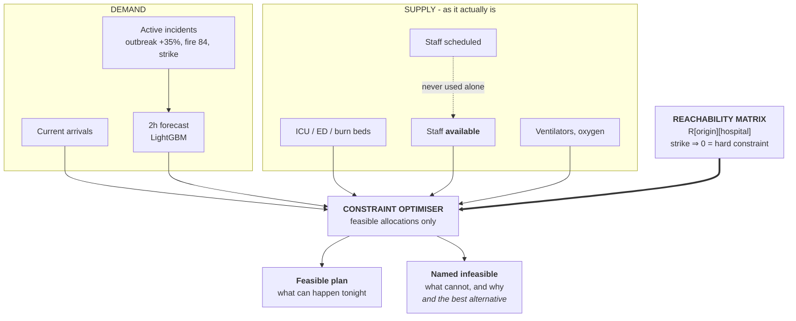

# Model Topology — From Features to a Defensible Rank

## 1. The model stack

**Specialist models plus fusion, not one large multimodal model.** Each component is separately
debuggable, separately explainable, and separately replaceable — which is what makes the 20%
explainability criterion attainable. You cannot SHAP your way out of a single opaque network.

**Note the three separate outputs.** Risk, confidence, and rank leave the decision engine as
distinct quantities and are never combined into one number anywhere downstream.

---

## 2. The uncertainty engine

Three independent contributors to confidence — **ensemble disagreement**, **distance from the
training distribution**, and **data completeness**. They answer different questions: *do my models
agree*, *have I seen patients like this*, and *do I have enough to go on*. A system using only one
of the three will be confidently wrong in the other two ways.

---

## 3. The ranking decision tree — the most defensible thing you build

### The two rules that make this defensible

**Rule 1 — Lexicographic, not blended.** Protocol assigns the acuity band; AI orders *within* it.
A patient can never be ranked above a higher acuity band by AI score alone.

*Why it matters:* a single blended score cannot answer "what authority did you override, and on
what basis?" A lexicographic policy can, in one sentence: *"We never override protocol. Protocol
doesn't order within a band — that's the gap we fill."*

**Rule 2 — Confidence gates, never boosts.** A low-confidence estimate never promotes a patient,
never demotes them below their protocol band, and routes them to priority human reassessment.

*Why it matters:* this is the T+8 answer. Patient B at 86% risk / 58% confidence does not outrank
Patient A at 83% / 96% on three percentage points the system does not trust. **The correct response
to uncertainty about a patient is to look at the patient**, not to reorder a queue on noise.

The decision engine is **readable policy code, not learned weights**. That is intentional — you can
put it on screen during questioning and walk a clinician through it line by line. A learned ranker
would score marginally better and be indefensible.

---

## 4. Resource constraint flow

**The `INFEASIBLE` output is a deliverable, not an error branch.** An optimiser that returns a
clean optimum during a transit strike is less credible, not more. Naming what is impossible —
"Hospital C's nurse pool cannot reach Hospital A tonight; corridor down" — is what earns the
staffing-realism criterion.

`SCHED -.-> AVAIL` is dotted because **scheduled staff are never used as an input to the
optimiser**. Only availability is. That single edge is the transit strike modelled properly.

---

## 5. Tier discipline

| Tier | Components | Rule |
|---|---|---|
| **Tier 1 — must work** | XGBoost + SHAP · GRU · ensemble + calibration · OOD · decision engine · resource optimiser | Demo fails without these |
| **Tier 2 — if stable** | BioClinicalBERT notes extraction | Dotted line in diagram 1 — the architecture is honest without it |
| **Tier 3 — do not build** | Medical imaging | Tabular + trajectory + text is already genuinely multimodal |

**Say the Tier 3 decision out loud to judges.** "We deliberately did not add an imaging model. It
would let us claim multimodality, and it would have cost the hours that explainability and
rehearsal needed." Stating a scope decision and its reason reads as engineering maturity —
considerably better than a half-working image classifier.