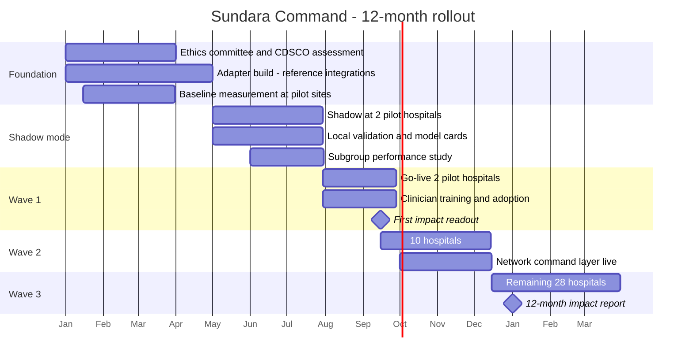
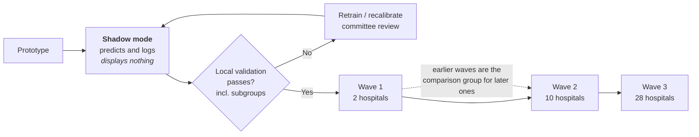

# Rollout Roadmap — Prototype to 40 Hospitals in 12 Months

The brief requires **measurable impact within 12 months of go-live** and a ₹58 crore ceiling. This
is the plan that delivers both without a big-bang deployment.

---

## 12-month plan

---

## Why phased, and why shadow mode first

**Shadow mode is non-negotiable.** The model predicts and logs on real local patients while
displaying nothing. It establishes performance on the actual population before it influences a
single decision — which is exactly the step Epic's sepsis model deployment skipped (FM-1 in
`/sundara-research`). Citing that failure as the reason for your rollout design is a strong
business-track answer.

**The wave structure doubles as the measurement design.** Sites that have not gone live are a
natural comparison group for sites that have, so impact can be attributed rather than merely
observed. That answers "how do you know it was you?" — a question that sinks most 12-month impact
claims.

---

## Gates between waves

No wave proceeds on schedule alone. Each gate is a decision by the Clinical AI Safety Committee,
not by the engineering team.

| Gate | Must be true |
|---|---|
| **Shadow → Wave 1** | Local validation meets the pre-registered threshold; **subgroup performance reported and acceptable**; model card published; ethics approval in hand |
| **Wave 1 → Wave 2** | Override rate stable or falling; no unresolved 72-hour incident review; **low-acuity 90th-percentile wait not increased** (BR-31); clinician adoption above threshold |
| **Wave 2 → Wave 3** | Network layer stable; drift monitoring operating with a named owner; impact readout consistent with targets |

**The BR-31 gate is the important one.** A wave cannot proceed if wait-time gains came from
starving low-acuity patients. It converts the brief's ethical requirement from a promise into a
stopping condition with teeth — and it is enforced technically by the starvation guard (FR-18),
not by good intentions.

---

## Budget across the phases

Full breakdown in `sundara-command/references/case-facts.md`.

| Phase | Dominant cost | ₹ crore |
|---|---|---|
| Foundation | Adapter build across heterogeneous systems | 14 (integration) |
| Shadow mode | Clinical validation | 8 |
| Waves 1–3 | Change management and training across 40 sites | 9 |
| Throughout | Platform and ML · infrastructure · governance | 10 · 6 · 4 |
| Reserve | Contingency ~12% | 7 |

**Integration plus change management is ₹23 crore — 40% of the programme — against ₹10 crore for
platform and ML.** That ratio is the point. Clinical AI programmes fail at integration and
adoption, not at modelling, and a budget weighted the other way would signal a team that has not
deployed into a hospital before.

---

## What is measured, and when

| Metric | Baseline | Target | First readout |
|---|---|---|---|
| Average ED wait | 51 min | ≤ 35 min | Month 9 |
| Critical identified after avoidable delay | 16% | ≤ 8% | Month 9 |
| **Low-acuity 90th-percentile wait** | measured | **must not increase** | Month 9, published alongside |
| Override rate | measured | stable or falling; investigated if rising | Monthly from Wave 1 |
| Subgroup performance parity | measured | no widening gap | Quarterly |

**Metrics are pre-registered before go-live.** Choosing metrics after seeing results is how
programmes report success they did not achieve — and a judge who asks "when did you decide what to
measure?" is asking exactly this.