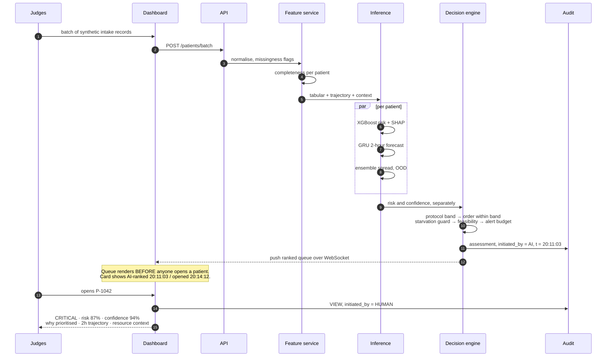
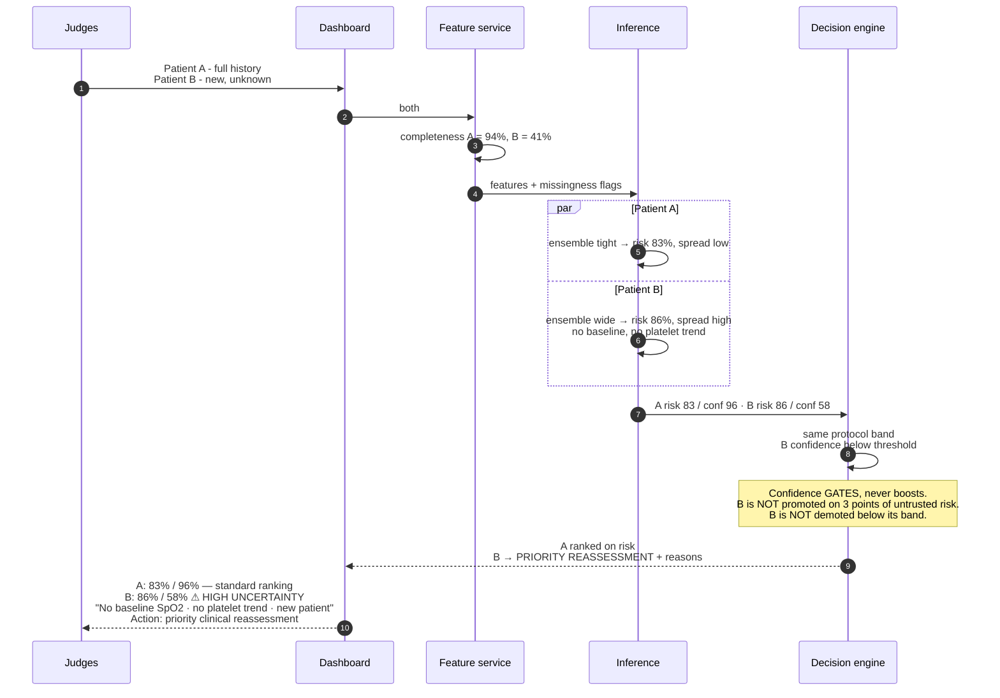
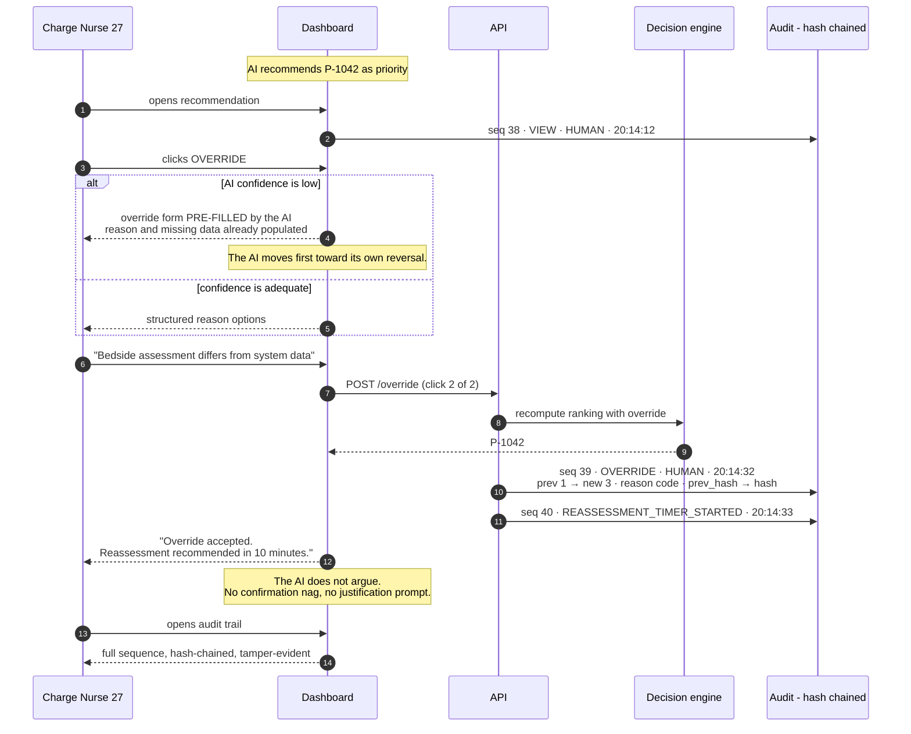
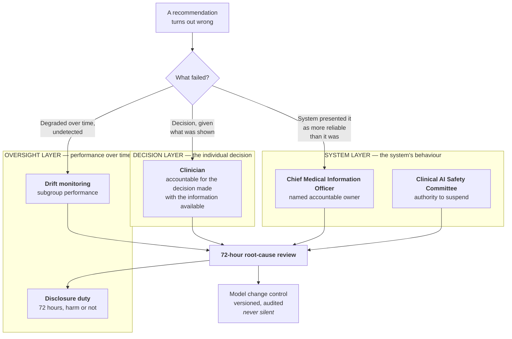

# Sequence Diagrams — The Three Judge Interventions

These fourteen minutes are the exam. Each diagram below is the system behaviour you must be able to
show live **and** narrate while it runs.

---

## T+0 — Synthetic intake, prioritised queue

Judges hand you a batch of dengue-deterioration and burn/trauma records. Tests criterion 1
(clinical relevance and proactive capability, 20%).

**Narrate step 11.** The queue ranked itself at 20:11:03 and a human opened it at 20:14:12. Point at
the timestamps: *"The system had already acted for three minutes before anyone looked."* That is
the theme, evidenced rather than asserted.

---

## T+8 — Near-identical acuity, different completeness

Judges introduce two patients with near-identical acuity, one with full history and one unknown,
and ask you to show live how confidence and ranking differ — **and why that difference is
defensible rather than arbitrary.** Tests criterion 3 (15%) and criterion 2 (20%).

**The sentence that wins this intervention** — rehearse it verbatim:

> "Patient B's risk estimate is higher, but our confidence in it is 58%. We don't promote a patient
> on a number we don't trust, and we don't demote them either. B goes to priority human
> reassessment with the missing data named. The correct response to uncertainty about a patient is
> to look at the patient — not to reorder a queue on noise."

That answers "defensible rather than arbitrary" directly: the difference in treatment comes from a
stated policy applied identically to both, not from a score.

---

## T+14 — The fatigued charge nurse overrides

Judges roleplay a charge nurse who disagrees with the top recommendation and ask you to show, on
screen, exactly how she overrides it and what happens to the audit trail. Tests criterion 5 (15%).

**Three things to point at while this runs:**

1. **Two clicks.** Override is not a buried escape hatch — it carries the same visual weight as
   Accept. A hard-to-find override is how automation bias gets designed in.
2. **The AI does not argue.** No "are you sure?", no justification demand. It accepts, and it
   schedules a reassessment. Say: *"The system defers. It just doesn't forget."*
3. **The hash chain.** Run the verify command live. Altering entry 39 invalidates 40 onward. *"The
   brief says this might end up in court. A log you can edit isn't evidence."*

---

## Governance — accountability swimlane

Who is answerable, for what, when the system is wrong. Detail in `/sundara-governance`.

**The answer to "who is accountable when the system is wrong" is not one name — it is a triage.**
The wrong question produces the wrong answer, so ask *what* failed first. A clinician is
accountable for a reasonable decision made on what they were shown; they are **not** accountable
for a system that presented a recommendation as more reliable than it was. That is the CMIO's.

Being able to state that distinction cleanly is most of criterion 5.