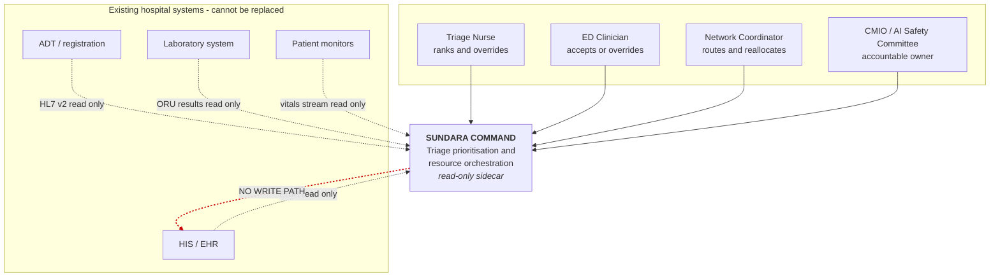
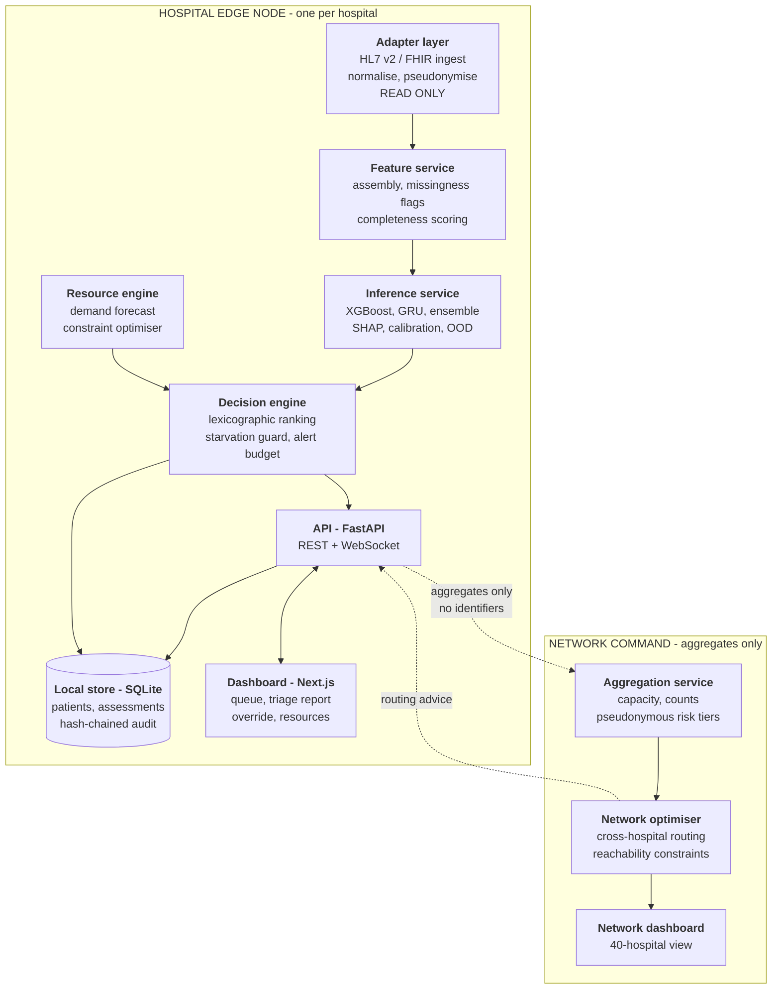
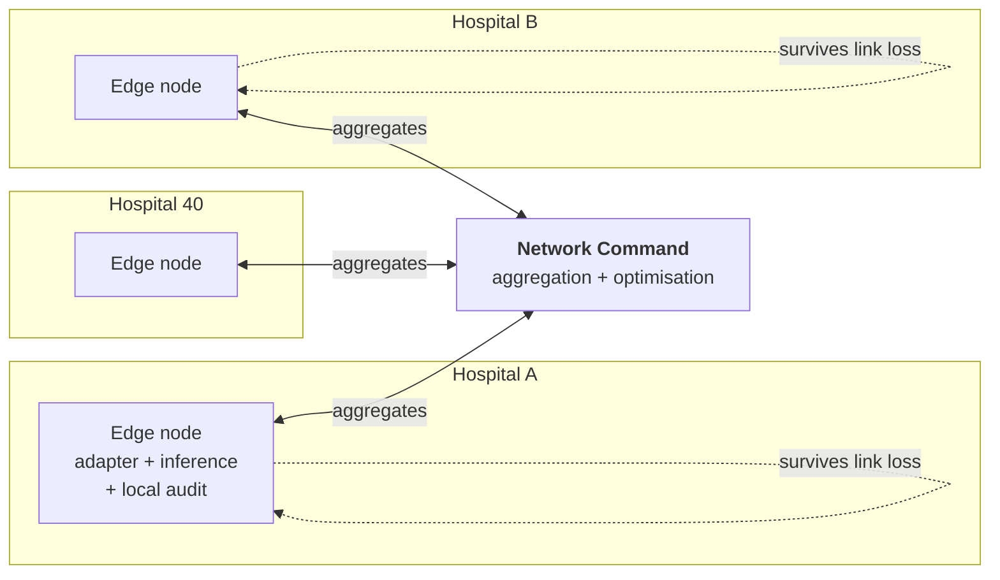

# System Architecture — Context, Containers, Deployment

## 1. C4 Level 1 — System context

**Use this as your opening architecture slide.** It shows a modest system sitting *beside*
hospital infrastructure rather than replacing it, which is the single most reassuring thing you can
show a clinical audience.

The crossed-out write path is deliberate. Point at it: *"There is no write path. Not disabled —
absent."*

---

## 2. C4 Level 2 — Containers

**The boundary between the two subgraphs is the privacy story.** Identifiable data lives only in
the edge node. Only counts, capacity, and pseudonymous tiers cross it — so the network view can
say "Hospital B: 1 ICU bed available" and can never show a patient list.

---

## 3. Deployment topology

**Every edge node functions standalone.** If the WAN drops, the ED keeps its triage support and
loses only cross-hospital routing advice — degraded, visibly, and never silently.

State that trade-off explicitly: on the night the network is most stressed is exactly the night a
centralised inference design would fail.

---

## 4. Component responsibilities

| Container | Owns | Explicitly does not |
|---|---|---|
| **Adapter** | Ingest, normalise, pseudonymise, buffer | Write anything back; interpret clinically |
| **Feature service** | Feature assembly, missingness flags, completeness | Impute missing values |
| **Inference** | Risk, trajectory, ensemble spread, SHAP, OOD | Rank patients; decide anything |
| **Decision engine** | Lexicographic ranking, starvation guard, alert budget, resource feasibility | Assign protocol bands; execute actions |
| **Resource engine** | Demand forecast, constraint optimisation, named infeasibility | Move staff or patients |
| **API** | REST + WebSocket, auth, audit writes | Business logic |
| **Dashboard** | Presentation, clinician actions | Compute risk or rank |
| **Network command** | Aggregation, cross-hospital routing | See identifiable patient data |

**The critical separation: inference produces numbers; the decision engine produces order.** They
are different services because they answer to different authorities — the model is a statistical
artefact, the ranking is a policy. Keeping them apart is what lets you tell a judge exactly where
the clinical policy lives and show it as readable code rather than as learned weights.

---

## 5. Technology choices

| Layer | Choice | Rationale |
|---|---|---|
| Frontend | Next.js + TypeScript | Demo ceiling; the dashboard carries the UX and presentation criteria |
| Backend | FastAPI, Python 3.13 | Same runtime as the models; native WebSocket |
| Transport | REST + WebSocket | The queue must re-rank visibly without a refresh |
| Models | XGBoost, PyTorch GRU, scikit-learn, SHAP | Tier 1 only |
| Store | SQLite | Zero setup, file-based, resettable between demo runs in one command |
| Packaging | uv, npm | Both verified present on the build machine |

**No Docker.** It is not installed on the build machine, and adding a container dependency the day
before judging is an avoidable failure mode. Everything runs natively.